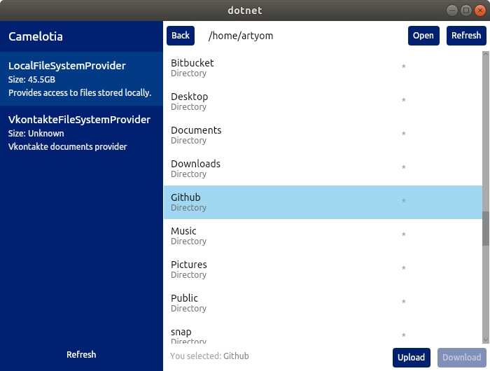

# Compiling

The app runs on Windows, Linux and MacOS. Make sure you have latest [.NET Core SDK](https://dot.net/) installed.



```
# Linux or MacOS shell
git clone https://github.com/worldbeater/Camelotia
cd Camelotia/Camelotia.Presentation.Avalonia
dotnet run
```

On Windows, run the `./run.bat` file.

### Adding Custom Providers

File system providers are located at `./Camelotia.Services/Providers/`. To add a custom file system provider, you need to create a separate class and implement the [IProvider](https://github.com/worldbeater/Camelotia/blob/master/Camelotia.Services/Interfaces/IProvider.cs) interface. It'll get integrated into the UI automagically.
