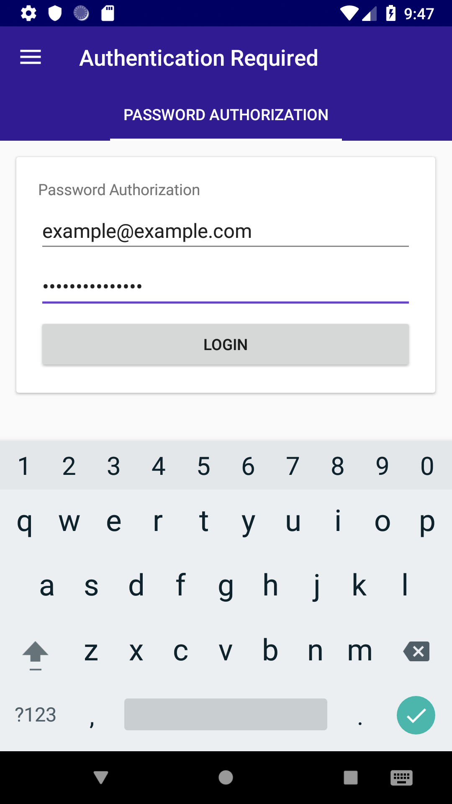
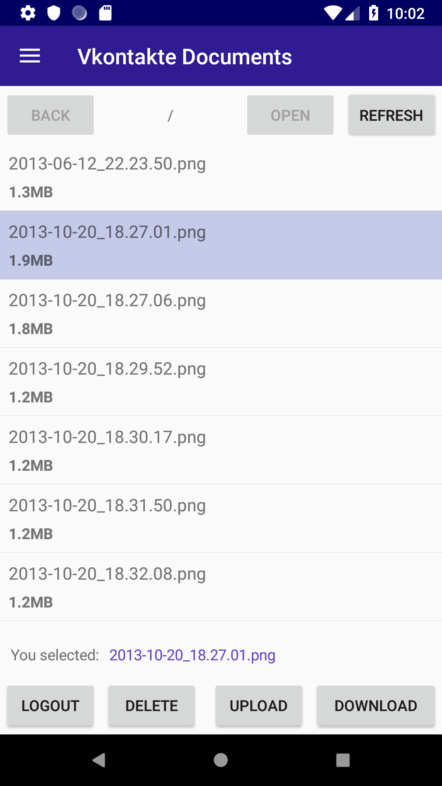

[](https://worldbeater.visualstudio.com/Camelotia/_build/latest?definitionId=1) [](https://github.com/worldbeater/Camelotia/pulls) [](https://github.com/worldbeater/Camelotia/issues)  

The app runs on Windows, Linux, MacOS, XBox, Surface Hub and HoloLens. Built with [ReactiveUI](https://github.com/reactiveui/ReactiveUI).

## Compiling Avalonia app

You can compile .NET Standard libraries, run tests and run an Avalonia application on Windows, Linux and macOS operating systems. Make sure you have latest [.NET Core SDK](https://dot.net/) installed.


```sh
# Linux or MacOS shell
git clone https://github.com/worldbeater/Camelotia
cd Camelotia/Camelotia.Presentation.Avalonia
dotnet run
```

On Windows, double-click the `./run.bat` file.

## Compiling Universal Windows Platform app

You can compile Universal Windows Platform Camelotia app only on latest Windows 10. Make sure you have latest [Microsoft Visual Studio](https://visualstudio.microsoft.com/) installed. Make sure the "Universal Application Development" section is checked in [Visual Studio Installer](https://visualstudio.microsoft.com/ru/vs/).

 

Supports light and dark themes!


## Compiling Xamarin Forms app

To compile the Xamarin Forms Android application, you need to install appropriate Android SDK v8.1. This can be achieved by using [Visual Studio Installer](https://visualstudio.microsoft.com/ru/vs/) and selecting "Mobile Development" section there.

 

### Adding Custom Providers

File system providers are located at `./Camelotia.Services/Providers/`. To add a custom file system provider, you need to create a separate class and implement the [IProvider](https://github.com/worldbeater/Camelotia/blob/master/Camelotia.Services/Interfaces/IProvider.cs) interface. Then, add your provider to composition root for each platform that should support it.

### Technologies and Tools Used

- <a href="https://reactiveui.net/">ReactiveUI</a> modern MVVM framework
- <a href="https://github.com/reactiveui/Akavache">Akavache</a> persistent key-value store
- <a href="http://github.com/avaloniaui">AvaloniaUI</a> cross-platform XAML-based GUI framework
- <a href="https://github.com/nsubstitute/NSubstitute">NSubstitute</a> mocking library
- <a href="https://github.com/fluentassertions/fluentassertions">FluentAssertions</a> assertions library
- <a href="https://docs.microsoft.com/en-us/xamarin/xamarin-forms/">Xamarin.Forms</a> mobile GUI framework
- <a href="https://docs.microsoft.com/en-us/windows/uwp/get-started/universal-application-platform-guide">Universal Windows Platform</a> SDK
- <a href="https://github.com/dotnet/reactive">Reactive Extensions</a> for .NET
- <a href="https://github.com/octokit/octokit.net">Octokit</a> GitHub client library
- <a href="https://github.com/robinrodricks/FluentFTP">FluentFTP</a> FTP implementation
- <a href="https://github.com/sshnet/SSH.NET/">SSH.NET</a> SFTP implementation
- <a href="https://github.com/vknet/vk">VkNet</a> Vkontakte SDK for .NET
- <a href="https://www.jetbrains.com/rider/">JetBrains Rider</a> and <a href="https://visualstudio.microsoft.com/">Microsoft Visual Studio</a> IDEs
