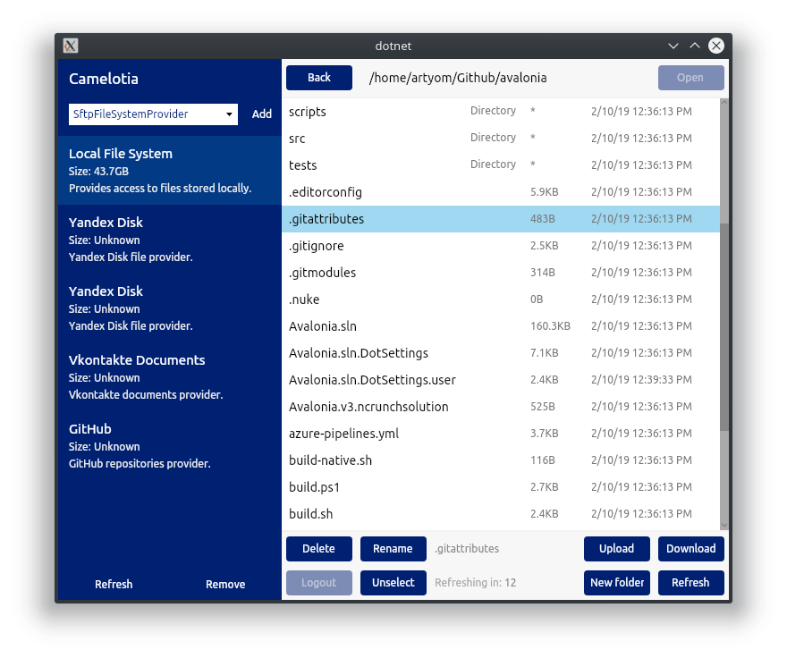
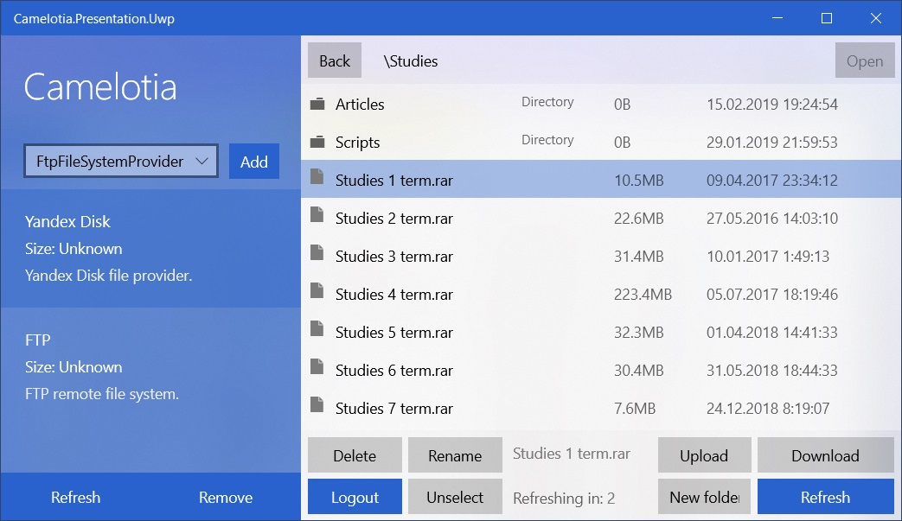

[](https://worldbeater.visualstudio.com/Camelotia/_build/latest?definitionId=1) [](https://github.com/worldbeater/Camelotia/pulls) [](https://github.com/worldbeater/Camelotia/issues)  

The app runs on Windows, Linux, MacOS, XBox, Surface Hub and HoloLens.

## Compiling Avalonia app

You can compile .NET Standard libraries, run tests and run an Avalonia application on Windows, Linux and macOS operating systems. Make sure you have latest [.NET Core SDK](https://dot.net/) installed.



```sh
# Linux or MacOS shell
git clone https://github.com/worldbeater/Camelotia
cd Camelotia/Camelotia.Presentation.Avalonia
dotnet run
```

On Windows, double-click the `./run.bat` file.

## Compiling Universal Windows Platform app

You can compile Universal Windows Platform Camelotia app only on latest Windows 10. Make sure you have latest [Microsoft Visual Studio](https://visualstudio.microsoft.com/) installed. Make sure the "Universal Application Development" section is checked in [Visual Studio Installer](https://visualstudio.microsoft.com/ru/vs/).



## Compiling Xamarin Forms app

To compile the Xamarin Forms Android application, you need to install appropriate Android SDK v8.1. This can be achieved by using [Visual Studio Installer](https://visualstudio.microsoft.com/ru/vs/) and selecting "Mobile Development" section there.

 

### Adding Custom Providers

File system providers are located at `./Camelotia.Services/Providers/`. To add a custom file system provider, you need to create a separate class and implement the [IProvider](https://github.com/worldbeater/Camelotia/blob/master/Camelotia.Services/Interfaces/IProvider.cs) interface. It'll get integrated into the UI automagically.

### Technologies and Tools Used

- <a href="https://reactiveui.net/">ReactiveUI</a>
- <a href="http://github.com/avaloniaui">AvaloniaUI</a>
- <a href="https://github.com/nsubstitute/NSubstitute">NSubstitute</a>
- <a href="https://github.com/fluentassertions/fluentassertions">FluentAssertions</a>
- <a href="https://www.jetbrains.com/rider/">JetBrains Rider IDE</a>
