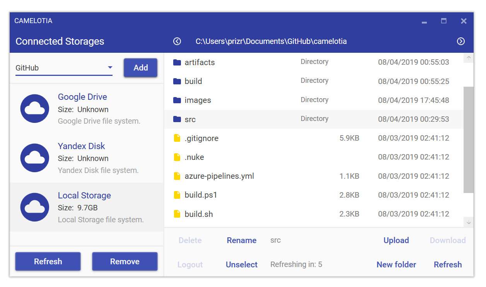

<p></p>

[](https://worldbeater.visualstudio.com/Camelotia/_build/latest?definitionId=1) [](https://github.com/worldbeater/Camelotia/pulls) [](https://github.com/worldbeater/Camelotia/issues)   [](https://worldbeater.visualstudio.com/Camelotia/_build/latest?definitionId=1)

Camelotia is a sample cross-platform application built with reactive extensions, [ReactiveUI](https://github.com/reactiveui/ReactiveUI), and modern .NET UI frameworks. Camelotia is a file manager for cloud storages, it currently supports Yandex Disk, Google Drive, VK Documents, GitHub, FTP, SFTP, and local file systems. The app runs on Windows, Linux, MacOS, XBox, Surface Hub and HoloLens.

### Compiling Avalonia app


In order to compile .NET Standard libraries, run tests and run the <a href="http://github.com/avaloniaui">Avalonia</a> application on Windows, Linux or MacOS operating system make sure to have latest [.NET Core SDK](https://dot.net/) installed. Launch the `Camelotia.Avalonia.sln` file to browse or to edit source files. Camelotia uses [Nuke Build](https://github.com/nuke-build/nuke) to build and test the solution. Execute the following commands to run the build scripts on Linux or MacOS:

```sh
# Linux or MacOS shell. Launches the Avalonia app after build.
git clone https://github.com/worldbeater/Camelotia
cd ./Camelotia && bash ./build.sh --interactive
```

On Windows, execute the following command line:

```sh
# Windows command line. Launches the Avalonia app after build.
# Use the '--full' option to compile Android, UWP and WPF apps as well.
# Use the '--configuration Release' option to generate app packages.
git clone https://github.com/worldbeater/Camelotia
cd ./Camelotia && powershell -ExecutionPolicy Unrestricted ./build.ps1 --interactive
```

### Compiling Universal Windows Platform app

 

<a href="https://docs.microsoft.com/en-us/windows/uwp/get-started/universal-application-platform-guide">Universal Windows Platform</a> Camelotia app is compatible with Windows 10-based devices, such as PCs, Xbox One and HoloLens. The app can be compiled only on latest Windows 10. Make sure to have latest [Microsoft Visual Studio](https://visualstudio.microsoft.com/) installed. Make sure the "Universal Application Development" section is checked in [Visual Studio Installer](https://visualstudio.microsoft.com/ru/vs/). Launch the `Camelotia.Uwp.sln` solution file.

### Compiling Windows Presentation Foundation app



The app was ported to WPF to make the cloud file manager controls reusable across most popular .NET implementations, so one could easily embed parts of Camelotia into their own applications by simply copying and pasting the source files. The app is also compatible with Windows versions lower than 10, such as Windows 7 or 8. To compile the WPF app, ensure the "Desktop Development" section is checked in [Visual Studio Installer](https://visualstudio.microsoft.com/ru/vs/). Then, open the `Camelotia.Wpf.sln` file in Visual Studio 2019.

### Compiling Xamarin Forms app

 

To compile the <a href="https://docs.microsoft.com/en-us/xamarin/xamarin-forms/">Xamarin.Forms</a> Android application, install the appropriate Android SDK v8.1. This can be achieved by using [Visual Studio Installer](https://visualstudio.microsoft.com/ru/vs/) and selecting "Mobile Development" section there. Launch the `Camelotia.Xamarin.sln` solution file.

### Technologies and Tools Used

- <a href="https://reactiveui.net/">ReactiveUI</a> modern MVVM framework
- <a href="https://github.com/reactiveui/reactiveui.validation">ReactiveUI.Validation</a> reactive validation library
- <a href="https://reactiveui.net/docs/handbook/events/">ReactiveUI.Events</a> turning regular events into observables
- <a href="https://github.com/reactiveui/DynamicData">DynamicData</a> reactive collections
- <a href="http://github.com/avaloniaui">AvaloniaUI</a> cross-platform XAML-based GUI framework
- <a href="http://github.com/worldbeater/citrus.avalonia">Citrus.Avalonia</a> bright and modern AvaloniaUI theme
- <a href="https://github.com/reactiveui/Akavache">Akavache</a> persistent key-value store
- <a href="https://github.com/nuke-build/nuke">Nuke</a> build automation system for C#/.NET
- <a href="https://github.com/xunit/xunit">XUnit</a> unit testing tool for .NET
- <a href="https://github.com/tonerdo/coverlet">Coverlet</a> code coverage analyzer
- <a href="https://github.com/nsubstitute/NSubstitute">NSubstitute</a> mocking library
- <a href="https://github.com/fluentassertions/fluentassertions">FluentAssertions</a> assertions library
- <a href="https://docs.microsoft.com/en-us/xamarin/xamarin-forms/">Xamarin.Forms</a> mobile GUI framework
- <a href="https://docs.microsoft.com/en-us/windows/uwp/get-started/universal-application-platform-guide">Universal Windows Platform</a> SDKs
- <a href="https://github.com/dotnet/reactive">Reactive Extensions</a> for .NET
- <a href="https://github.com/octokit/octokit.net">Octokit</a> GitHub client library
- <a href="https://github.com/robinrodricks/FluentFTP">FluentFTP</a> FTP implementation
- <a href="https://github.com/sshnet/SSH.NET/">SSH.NET</a> SFTP implementation
- <a href="https://github.com/vknet/vk">VkNet</a> Vkontakte SDK for .NET
- <a href="https://github.com/googleapis/google-api-dotnet-client">Google Drive</a> client SDK for .NET
- <a href="https://github.com/MaterialDesignInXAML/MaterialDesignInXamlToolkit">Material Design</a> XAML controls and styles
- <a href="https://github.com/MahApps/MahApps.Metro">MahApps Metro</a> XAML controls and styled windows
- <a href="https://github.com/Fody/Costura">Costura.Fody</a> which embeds references as resources
- <a href="https://www.jetbrains.com/rider/">JetBrains Rider</a> and <a href="https://visualstudio.microsoft.com/">Microsoft Visual Studio</a> IDEs
- <a href="https://github.com/fornever/avaloniarider">AvaloniaRider</a> plugin for visual designer support
